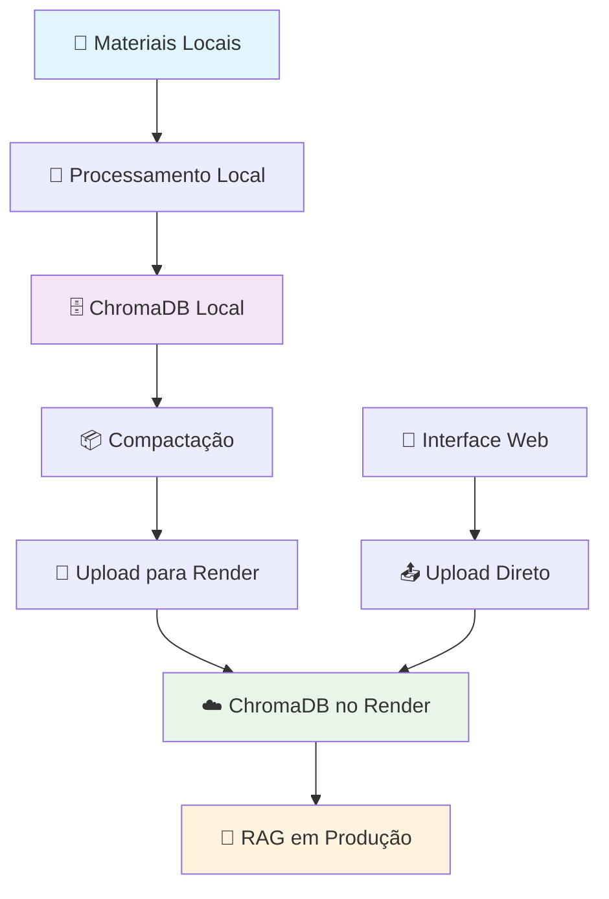

# 🎯 Abordagem Recomendada: Treinamento Local + Upload do ChromaDB

Para otimizar recursos do Render e garantir melhor performance, recomendamos:

1. **Treinar localmente**: Use sua máquina para processar materiais e gerar o ChromaDB
2. **Upload do índice**: Transfira apenas o `.chromadb` treinado para o Render
3. **Evitar reprocessamento**: O Render apenas carrega o índice pronto

## 🏗️ Arquitetura de Dados

| Componente        | Local (Desenvolvimento)   | Render (Produção)              |
| ----------------- | ------------------------- | ------------------------------ |
| **Materiais**     | `backend/data/materials/` | `/app/data/materials/`         |
| **ChromaDB**      | `backend/data/.chromadb/` | `/app/data/.chromadb/`         |
| **Processamento** | ✅ Recomendado            | ❌ Evitar (recursos limitados) |
| **Upload**        | Magic-Wormhole/Interface  | Recebe índice pronto           |
| **RAG Queries**   | Desenvolvimento/Testes    | ✅ Produção                    |

## 📊 Fluxo de Trabalho Recomendado



## ✅ Vantagens desta Abordagem

- **🚀 Performance**: Render não gasta recursos processando
- **💰 Economia**: Menos tempo de CPU/RAM no Render
- **🔧 Flexibilidade**: Ajustes e testes locais
- **⚡ Deploy Rápido**: Apenas upload do índice
- **🛡️ Confiabilidade**: Evita timeouts de processamento

---

# Guia Operacional: Sincronização em Partes, Importação de Lotes e Transferência Direta (Render e Local)

Este guia documenta como operar o sistema de materiais de forma robusta no Render e localmente, incluindo:

- Sincronização do Google Drive por módulos (em partes), com profundidade limitada e progresso.
- Importação em lote de materiais via `.zip` e `.tar.gz/.tgz` preservando subpastas.
- Transferência direta de arquivos para o disco persistente do Render usando Magic‑Wormhole.

Referência oficial Render (Persistent Disks e Magic‑Wormhole):

- https://render.com/docs/disks#magic-wormhole

---

## 1) Configuração de Ambiente

### 1.1 Render (Backend)

- Anexe um Persistent Disk ao serviço (Dashboard → Service → Disks):
  - Mount Path: `/app/data`
  - Tamanho: conforme necessidade (ex.: 10–50 GB)
- Variáveis de ambiente (Settings → Environment):
  - `MATERIALS_DIR=/app/data/materials`
  - `EXPORT_GOOGLE_DOCS=true` (Docs/Sheets/Slides ➜ PDF)
  - `INCLUDE_DRIVE_VIDEOS=false` (NÃO baixar vídeos)
  - `RAG_SERVER_URL=https://dna-forca-rag-server.onrender.com` (ou o seu)
  - `CORS_ORIGINS=https://dna-forca-frontend.onrender.com,http://localhost:3000,http://127.0.0.1:3000`
- Redeploy após alterar envs/disco.

### 1.2 Frontend (Produção)

- `VITE_API_BASE_URL=https://dna-forca-api-server.onrender.com`
- Redeploy do frontend.

### 1.3 Local (Desenvolvimento)

- Backend (.env ou env vars):

```
MATERIALS_DIR=C:/caminho/absoluto/para/backend/data/materials
RAG_SERVER_URL=http://localhost:5001
EXPORT_GOOGLE_DOCS=true
INCLUDE_DRIVE_VIDEOS=false
```

- Rode RAG (porta 5001) e API (5000).
- Frontend: `npm run dev` (proxy `/api` ➜ `http://localhost:5000`).

---

## 2) Onde os arquivos são salvos

- Todos os arquivos baixados ou importados vão para `MATERIALS_DIR`:
  - Render: `/app/data/materials`
  - Local: por padrão `backend/data/materials` (ou defina `MATERIALS_DIR`).
- Endpoints de listagem e navegação:
  - `GET /materials` (lista flat)
  - `GET /materials/browse?path=...` (navegação não-recursiva por pasta)

---

## 3) Sincronização por Módulos (em partes)

Use este fluxo para processar acervos grandes no Render sem OOM/timeouts, baixando módulo a módulo, com lotes pequenos.

### 3.1 Endpoint

- `POST /drive/download-module`

### 3.2 Parâmetros

- `folder_id` (string): ID da pasta raiz no Drive
- `module_name` (string, opcional): processa apenas um módulo (nome exato da subpasta de 1º nível)
- `module_prefix` (string, opcional): processa todos os módulos que começam com esse prefixo (ex.: "Módulo ")
- `batch_size` (int, opcional): módulos por iteração (default: 3)
- `max_depth` (int, opcional): profundidade por módulo (recomendado 1–2)
- `download_files` (bool): true
- `api_key` (string, opcional)

### 3.3 Progresso

- `GET /drive/download-progress?download_id=...`
- Campos extras: `current_module`, `processed_modules`.

### 3.4 Exemplos

- Um módulo específico:

```json
{
  "folder_id": "ROOT_FOLDER_ID",
  "module_name": "Módulo 07 - Fisiologia...",
  "max_depth": 2,
  "download_files": true,
  "api_key": ""
}
```

- Em partes (prefixo), 2 por vez:

```json
{
  "folder_id": "ROOT_FOLDER_ID",
  "module_prefix": "Módulo ",
  "batch_size": 2,
  "max_depth": 2,
  "download_files": true,
  "api_key": ""
}
```

### 3.5 Dicas de performance

- Use `batch_size` pequeno (2–3) e `max_depth` baixo (1–2).
- Habilite `EXPORT_GOOGLE_DOCS=true` e mantenha `INCLUDE_DRIVE_VIDEOS=false`.

---

## 4) Sincronização Recursiva (modo completo)

- `POST /drive/sync-recursive` com `folder_id` e `max_depth`.
- Observação: em estruturas muito grandes, prefira o fluxo por módulos para evitar quedas.

---

## 5) Importação em Lote (.zip / .tar.gz)

Importe um pacote com toda a árvore de materiais diretamente para `MATERIALS_DIR`.

### 5.1 Endpoint

- `POST /materials/upload-archive`
- Form-data:
  - `archive` = arquivo `.zip` ou `.tar.gz`/`.tgz`
  - `destination_subdir` (opcional): subpasta de destino dentro de `MATERIALS_DIR`

### 5.2 Exemplo (curl)

```bash
curl -X POST "https://dna-forca-api-server.onrender.com/materials/upload-archive" \
  -H "Authorization: Bearer SEU_TOKEN" \
  -F "archive=@C:/caminho/materials.tar.gz" \
  -F "destination_subdir=importados"
```

### 5.3 Observações

- Preserva subpastas; ideal para acervos já baixados localmente.
- Após importar, use `/materials` e `/materials/browse` para verificar, e atualize a UI.

---

## 6) Transferência direta para o Disk do Render (Magic‑Wormhole)

Para grandes volumes, o Magic‑Wormhole é simples e evita CORS/timeouts. Documentação oficial Render: https://render.com/docs/disks#magic-wormhole

### 6.1 No Render (Shell do serviço)

- Native Runtime: `wormhole` geralmente já disponível.
- Docker (Debian/Ubuntu): instalar temporariamente (até próximo deploy):
  - `apt-get update && apt-get install -y magic-wormhole`
- Via Python (se preferir): `pip install --user magic-wormhole` e use `~/.local/bin/wormhole`.

### 6.2 Fluxo

1. No Render (Shell):

```
cd /app/data/materials
wormhole receive
```

2. Na máquina local:

```
pip install magic-wormhole
wormhole send C:/caminho/materials.tar.gz
```

3. Copie o código exibido no `send` e cole somente o código no prompt do `receive` (Render) e tecle Enter.
4. Extraia se necessário:

```
cd /app/data/materials
tar -xzf materials.tar.gz
```

> Apenas arquivos sob `/app/data` (mount do Disk) persistem entre deploys.

---

## 7) Download & Exclusão

- Download: `GET /materials/{caminho/relativo}`
  - PDF/TXT: público; DOCX/PPTX: requer token Bearer.
- Exclusão: `DELETE /materials/{caminho/relativo}` (admin/instructor)
- Dicas:
  - Use caminhos URL-encoded (espaços/acentos).
  - Para arquivos protegidos via browser, prefira fetch+blob (o header Authorization não vai em links diretos).

---

## 8) CORS & Autenticação (erros comuns)

- CORS (502/"No 'Access-Control-Allow-Origin'"):
  - Backend: `CORS_ORIGINS` deve conter exatamente `https://dna-forca-frontend.onrender.com` (e locais se necessário).
  - Frontend: `VITE_API_BASE_URL` deve apontar para a API no Render.
- 401 Not authenticated:
  - Faça login na UI (token em `localStorage`). `apiRequest`/`apiRequestJson` adicionam o Authorization automaticamente.

---

## 9) Checklist Rápido

- [ ] Render: Disk em `/app/data` e `MATERIALS_DIR=/app/data/materials`.
- [ ] Render: `CORS_ORIGINS` inclui `https://dna-forca-frontend.onrender.com`.
- [ ] Frontend: `VITE_API_BASE_URL` = domínio da API em produção.
- [ ] Login (admin/instructor) antes de usar `/drive/*`.
- [ ] Recursivo grande: prefira `/drive/download-module` com `module_prefix`, `batch_size` e `max_depth`.
- [ ] Importação em lote: `POST /materials/upload-archive` ou Magic‑Wormhole.

---

## 10) Observações de Performance

- `EXPORT_GOOGLE_DOCS=true` e `INCLUDE_DRIVE_VIDEOS=false` (economiza tempo/armazenamento).
- `batch_size` pequeno (2–3) e `max_depth` baixo (1–2) reduzem muito memória/CPU.
- Em acervos enormes, considere instância Render com mais RAM/CPU e dividir importações.

---

## 11) RAG: Uso de ChromaDB pré‑treinado e Sincronização de Materiais (API → RAG)

Esta seção explica como:

- Usar um ChromaDB já treinado localmente no Render (sem reprocessar).
- Sincronizar materiais do serviço API para o serviço RAG (server‑to‑server) quando precisar de citações (arquivo/página).

### 11.1 Variáveis no Render

- RAG service:
  - `CHROMA_PERSIST_DIR=/app/data/.chromadb`
  - `MATERIALS_DIR=/app/data/materials`
  - Disk montado em `/app/data`
- API service:
  - `RAG_SERVER_URL=https://dna-forca-rag-server.onrender.com`

### 11.2 Usar ChromaDB pré‑treinado (local → Render)

1. Validar localmente se o índice tem texto (não só embeddings):

```
python - << 'PY'
from langchain_openai import OpenAIEmbeddings
from langchain_chroma import Chroma
vs = Chroma(collection_name="langchain", persist_directory="backend/data/.chromadb",
            embedding_function=OpenAIEmbeddings(model="text-embedding-3-small"))
data = vs.get()
print("docs_count:", len(data.get("documents", [])))
print("doc_sample_len:", len((data.get("documents") or [""])[0] or ""))
PY
```

2. Compactar (PowerShell):

```
tar -czf chromadb.tar.gz -C backend\data\chromadb .
```

3. Enviar para o Render (ex.: Magic‑Wormhole):

```
# Local
python -m pip install --upgrade magic-wormhole
wormhole send chromadb.tar.gz

# Render (shell do serviço RAG)
pip install --no-cache-dir magic-wormhole
cd /app/data
wormhole receive
mkdir -p /app/data/.chromadb
tar -xzf chromadb.tar.gz -C /app/data/.chromadb
```

4. Reiniciar o serviço RAG e validar:

```
curl -s https://dna-forca-rag-server.onrender.com/status | jq '{persist_dir, vector_store_ready, vector_store_count}'
```

5. Ajustar embeddings/busca (se necessário):

```
curl -s -X POST https://dna-forca-rag-server.onrender.com/assistant/config \
  -H "Content-Type: application/json" \
  -d '{"embeddingModel":"text-embedding-3-small","retrievalSearchType":"similarity","retrieval_k":8,"retrieval_fetch_k":50}'
```

6. Testar consulta:

```
curl -s -X POST https://dna-forca-rag-server.onrender.com/query \
  -H "Content-Type: application/json" \
  -d '{"question":"Explique princípio da sobrecarga","user_level":"intermediate"}'
```

> Importante: não rode reprocessamento se você não subiu também os materiais.

### 11.3 Sincronizar Materiais API → RAG (server‑to‑server)

Use quando precisar de citações precisas (arquivo/página) ou reindexar.

- Endpoints:

  - API: `GET /materials/archive` (gera `.tar.gz` de toda a pasta `materials/`, requer auth)
  - RAG: `POST /materials/sync-from-api` (baixa/extrai do API), `GET /materials/list`, `POST /reprocess-enhanced-materials`

- Fluxo:

```
# RAG baixa do API e extrai em MATERIALS_DIR
curl -s -X POST https://dna-forca-rag-server.onrender.com/materials/sync-from-api \
  -F 'api_base_url=https://dna-forca-api-server.onrender.com' \
  -F 'token=SEU_JWT_DO_API'

# Verificar arquivos no RAG
curl -s https://dna-forca-rag-server.onrender.com/materials/list

# Reprocessar com metadados educacionais e citações por página
curl -i -X POST https://dna-forca-rag-server.onrender.com/reprocess-enhanced-materials
```

### 11.4 Upload direto de materiais no RAG

```
curl -i -X POST https://dna-forca-rag-server.onrender.com/materials/upload-archive \
  -F "archive=@/caminho/materials.zip"
```

### 11.5 Diagnóstico rápido

- Status do RAG:

```
curl -s https://dna-forca-rag-server.onrender.com/status
```

- Materiais visíveis no RAG:

```
curl -s https://dna-forca-rag-server.onrender.com/materials/list
```

- Teste de vetor no container (Render):

```
python - << 'PY'
from langchain_openai import OpenAIEmbeddings
from langchain_chroma import Chroma
vs = Chroma(collection_name="langchain", persist_directory="/app/data/.chromadb",
            embedding_function=OpenAIEmbeddings(model="text-embedding-3-small"))
docs = vs.similarity_search("hipertrofia", k=8)
print("retrieved:", len(docs))
for i, d in enumerate(docs):
  print(i+1, d.metadata, len(d.page_content))
PY
```

### 11.6 Problemas comuns

- `vector_store_count` alto, mas busca retorna 0:
  - Índice sem `documents` (só embeddings). Reindexe no RAG com PDFs (sincronize materiais e reprocessar) ou gere localmente um `.chromadb` com texto e reenviar.
  - Versões divergentes de `chromadb/langchain` entre local e Render. Alinhe versões no `backend/config/requirements.txt`.
  - Modelo de embedding diferente. Ajuste via `POST /assistant/config`.
- Diretório incorreto:
  - Use exatamente `CHROMA_PERSIST_DIR=/app/data/.chromadb` (com ponto). Liste com `ls -la /app/data`.
- Segurança:
  - Proteja a sincronização com token (JWT admin/instructor no API). Se necessário, adote um `X-SYNC-TOKEN` compartilhado.
